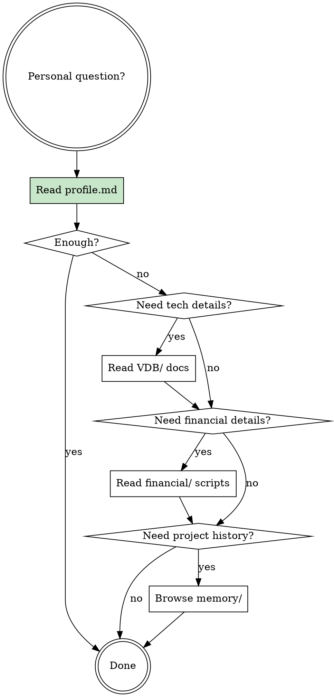

# Personal Context Lookup

The user maintains a structured context repository. Read it to answer personal questions accurately.

## Repository Location

```
f:\Code\Context
```

If this path doesn't exist, check the `PERSONAL_CONTEXT_REPO` environment variable.

## Lookup Procedure



1. **Always start**: Read `profile.md` — covers 80%+ of questions (background, career, tech stack, investments, personality)
2. **GPU/CUDA details**: Read `VDB/VDB.md` and files under `VDB/交接文档/`
3. **Investment/FIRE planning**: Read Python scripts under `financial/` for methodology and parameters
4. **Cross-project history**: Browse `memory/<project-name>/MEMORY.md` indices

## Source Index

| Source | Content |
|--------|---------|
| `profile.md` | Full profile: 硕士毕业、思看科技GPU实习、FIRE规划、永久投资组合、技术栈、性格特征 |
| `VDB/` | GPU VDB sparse volume, TSDF fusion system (DeepFusionPoints), CUDA optimization |
| `financial/` | 哈利·布朗永久投资组合回测、FIRE退休模拟、支付宝基金筛选 |
| `memory/` | Synced memory snapshots from all Claude Code projects |

## Common Mistakes

- Guessing personal details instead of reading `profile.md` — always read first
- Answering financial questions without checking the actual backtest parameters in `financial/`
- Assuming VDB project details from general knowledge — the implementation has specific constraints (laptop GPU, Windows-only, IO-bound at 10^10 voxels)
