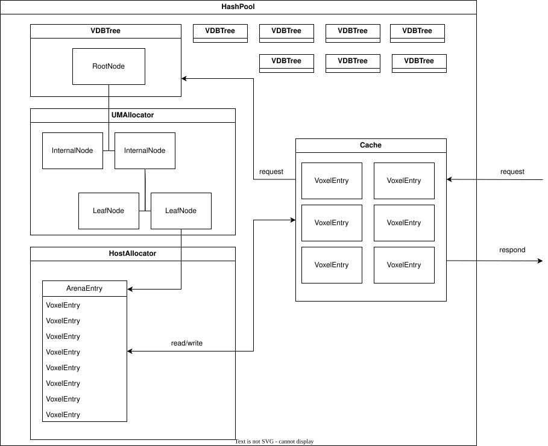

# OpenVDB的GPU加速方案

## 背景

VDB是三维建模领域应用十分广泛的一种稀疏数据结构，使用类B+树结构来、高效存储和操作在三维网格上离散化的稀疏体积数据，能够获得良好的缓存和I/O效率。另外还可以方便的在不同分辨率下存储数据。当前领域内该结构的标准实现为OpenVDB，但是它无法利用GPU加速。Nvidia实现了一个精简版本的nanoVDB，但是它有一个很大的限制是只能处理静态网格。我在去年实习的过程中参考OpenVDB实现了GPU上可动态调整网格结构的VDB。

## 相关工作

1. OpenVDB https://dl.acm.org/doi/abs/10.1145/2487228.2487235

    baseline

2. NanoVDB https://dl.acm.org/doi/abs/10.1145/3450623.3464653

    CUDA加速，静态网格

3. GVDB https://dl.acm.org/doi/10.5555/2977336.2977351

    CUDA加速，光追用，动态网格，但是必须要在CPU侧修改网格结构

4. fvDB https://dl.acm.org/doi/abs/10.1145/3658226

    CUDA加速，神经网络训练用，实现了大量微分算法，好像可以动态修改网格结构

5. Distributed Sparse Block Grids on GPUs https://dl.acm.org/doi/10.1007/978-3-030-78713-4_15

    GPU加速的稀疏体素数据结构，可以扩展到多卡，不是VDB

6. DCGrid https://dl.acm.org/doi/abs/10.1145/3522608

    用于流体模拟的GPU加速的稀疏数据结构，特点是可根据显存限制自适应调整分辨率

可以搜索到的相关工作中基本没有可GPU加速且可动态调整网格结构的VDB库，唯一能找到的fvDB专注于AI领域。

## 内容

已实现：

- 将VDB的索引和数据分离，索引放在显存中，数据放在锁页内存中，在显存中开辟一个小的数据缓存进行加速。

- 使用内存池分配节点内存，增加数据连续性，提高缓存和PCIE传输的效率。

- 启动Kernel前在内存池中预留足够的空闲空间，避免在gpu侧调用malloc。

可以做的：

- 内存池优化：将容易一起访问的数据放到相邻位置来充分利用缓存和PCIE连续读写效率
- 内存池支持删除数据
- 预测接下来可能使用的网格点并做预取（运动向量等）
- 利用高版本CUDA的特性做异步数据加载等
- 减少锁的使用，提高并发性

