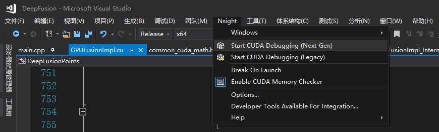
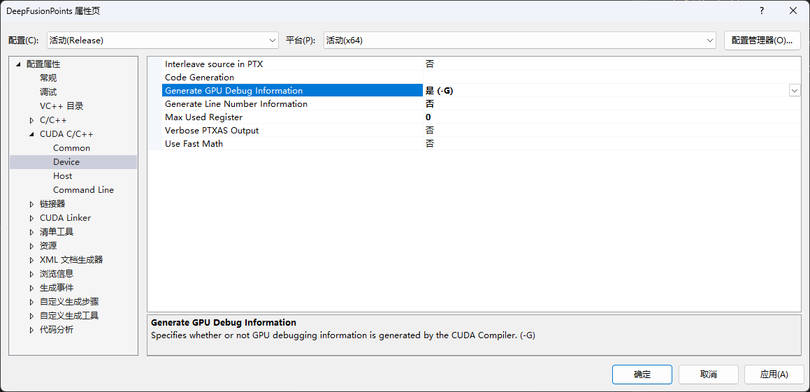

# CUDA调试笔记

author: yingyufeng0561@3d-scantech.local

date: 2023/08/17

## CUDA断点调试

CUDA代码的调试可以使用CUDA自带的Nsight VS插件，成功安装CUDA和VS后该插件应当自动出现在菜单栏中，如下图所示，Nsight - Start CUDA Debugging (Next-Gen)启动调试，之后与VS内置调试相同，可以正常在`__device__`函数里打断点。



Nsight - Options中有部分选项设置推荐调整，现列举如下：

| 选项                                       | 功能                                                         | 推荐设置值 |
| ------------------------------------------ | ------------------------------------------------------------ | ---------- |
| CUDA/Enable Memory Checker                 | 报告非法地址访问                                             | True       |
| CUDA/Kill Threads Before Access Violations | 阻止非法访存的线程，使其余线程可以run to completion，减少kernel launch silent failure | True       |
| CUDA/Synchronize Memory Access             | 同步内存访问，如果开启该选项后程序行为变化说明可能某些位置需要加内存屏障 | True       |
| CUDA/Break on CUDA API Errors              | Kernel启动参数不正确时自动中断                               | True       |

为了在Kernel中设置断点需要开启编译选项Generate GPU Debug information，路径为项目属性 - CUDA C/C++ - Device，如下图所示。

注意该选项会极大减慢GPU代码运行速度。



## 内存越界检查器

CUDA套件自带了一个命令行小工具`compute-sanitizer`，可以执行内存越界和线程冲突检查，速度比较慢。

具体使用参考[NV的Blog](https://developer.nvidia.com/blog/debugging-cuda-more-efficiently-with-nvidia-compute-sanitizer/)

## 常见Bug记录

由于GPU硬件架构与CPU不同，Kernel执行模型不同于正常函数调用，带来了一些CUDA特有的代码运行特性，列举如下。

### Warp同步与死锁

以下代码在Kernel运行时会导致死锁：

```c++
static int lock = 0;

__device__ void do_something_with_lock()
{
	while (atomicCAS(&lock, 0, 1) != 0) { } // spin wait for lock
    do_some_thing();
    atomicExch(&lock, 0); // release lock
}
```

其原因为GPU在运行时将Kernel拆解为若干Warp，每一个Warp中包含32个属于同一个Block的Thread，一个Warp只有一个指令序列，因此遇到分支时GPU会先执行走第一个分支的线程，再执行走第二个分支的线程，然后在合适的地方让两部分线程重新同步。上述代码中编译器判断while循环后可以同步，因此实际执行的代码类似于：

```c++
__device__ void do_something_with_lock()
{
	while (atomicCAS(&lock, 0, 1) != 0) { } // spin wait for lock
    // convergent point
    __syncthreads();
    do_some_thing();
    atomicExch(&lock, 0); // release lock
}
```

因此32个线程中的一个获得锁跳出循环后在汇聚点等待，其余线程在循环中等待获取锁，整个warp死锁。

为了防止这种情况出现，可以做如下修改：

```c++
__device__ void do_something_with_lock()
{
	bool flag = true;
	while (flag)
	{
		int old = atomicCAS(&lock, 0, 1);
		if (old == 0)
		{
			do_some_thing();
			atomicExch(&lock, 0);
			flag = false;
		}
        // convergent point
	}
    // convergent point
}
```

这样所有分支代码后的隐式同步都不会阻塞整个Warp。

> 注：计算能力7.2及以上不会出现这种死锁

### MemoryFence

以下代码从数组中读取KV对并将相同key的多个val求和。

```C++
__global__ void insertMap(HashMap *map, int *keys, int *vals)
{
    int thread_idx = blockIdx.x * blockDim.x + threadIdx.x;
    int key = keys[thread_idx];
    int val = vals[thread_idx];
	map->waitforLock()
    if (!map->flag[key]) // check flag corresponding to the key
    {
        map[key] = 0;
        map->flag[key] = true;
    }
    map->releaseLock();

	atomicAdd(&map[key], val);
}
```

上述代码运行后求和结果可能不正确，因为不同Warp之间内存读写不保证可见性。GPU上可以同时运行多个Warp，它们拥有独立的缓存，并且（看上去）不保证缓存一致性。另外一个可能的原因是为了提高访存性能内存对请求队列进行了重排（CUDA采用了弱一致性内存模型）。

因此存在如下情况：

- 线程A和线程B的key相同，线程A先获得锁，检查并插入key，此时`map[key] == 0`。
- 线程A释放锁，累加val，结束执行。
- 线程B获得锁并且线程A的写操作尚未提交到Global Memory，因此B发现`map->flag[key] == false`。
- 线程B将`map[key]`清零，导致累加值错误

为防止这种情况可以添加内存屏障：

```C++
__global__ void insertMap(HashMap *map, int *keys, int *vals)
{
    int thread_idx = blockIdx.x * blockDim.x + threadIdx.x;
    int key = keys[thread_idx];
    int val = vals[thread_idx];
	map->waitforLock()
    if (!map->flag[key]) // check flag corresponding to the key
    {
        map[key] = 0;
        map->flag[key] = true;
    }
    __threadfence(); // ensure write op to map[key] and map->flag[key] visible to other threads
    map->releaseLock();

	atomicAdd(&map[key], val);
}
```

线程A执行到line 12时确保其写操作已经同步到内存，因此线程B不会重复初始化。

### 统一内存访问越界

该Bug为统一内存（Unified Memory）本身bug，在多异步流并行情况下更容易触发，表现为统一内存管理的内存区域出现读写访问权限冲突异常或者空指针异常。这通常是由于Host侧和Device侧同时读写统一内存区域。统一内存通过内存拷贝来支持Host、Device访问，因此不支持并发访问。有时候程序没有并发访问仍出现该bug，推测是CUDA的bug，最佳解决方案仍是手动调用CudaMemcpy管理内存拷贝。