# CUDA性能优化笔记

author: yingyufeng0561@3d-scantech.local

date: 2023/08/17

## 0、开始优化之前

#### 确保项目可以构建、正常运行并通过单元测试

详见CUDA Debug

#### 确保CPU侧代码不存在性能瓶颈

CUDA程序是CPU/GPU异构程序，部分代码仍然是在CPU上运行的，在做GPU侧性能调优前先关注这部分代码。请使用常规的代码性能调优方法处理该部分。

#### 备份

遇事不决`git commit`/`git stash`一下

## 1、使用NVVP进行全局性能优化

Nvidia Visual Profiler (NVVP)是CUDA套件中的一个可视化耗时分析器，可以很方便地监测整个时间线上CUDA API和Kernel的调用情况，profile开销很小，适合粗粒度的性能分析，配合VS诊断工具即可获得全局的函数调用关系与耗时。

NVVP包含在CUDA套件中，无需单独安装。

### 使用流程

- 打开NVVP，默认显示空窗口，左上角选择File - New Session 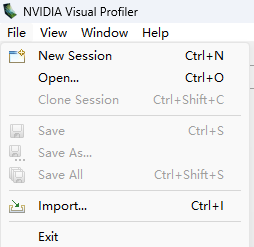

- 在创建新会话界面，选择要进行profile的可执行文件，在下一页设置profile参数（一般不需要调整）

    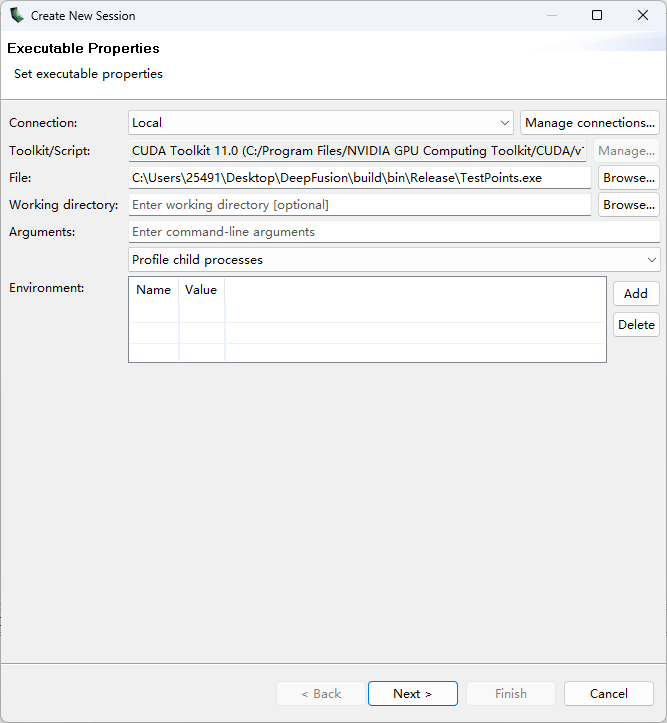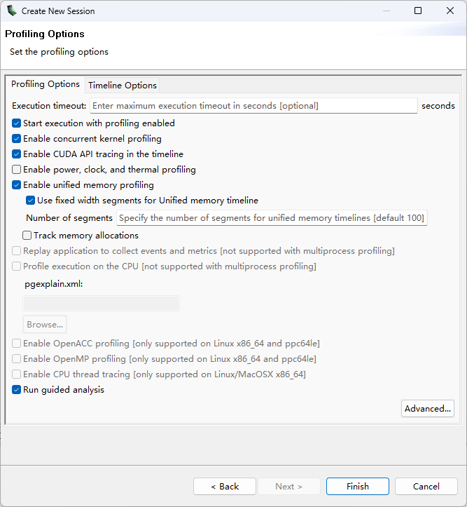

- 完成设置后会自动开始profile，下方窗口为命令行界面，可以输入输出

    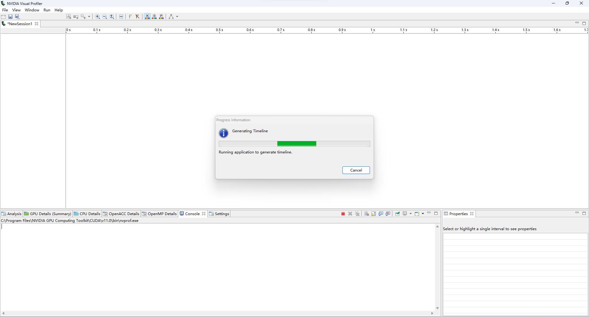

- 程序运行结束后

    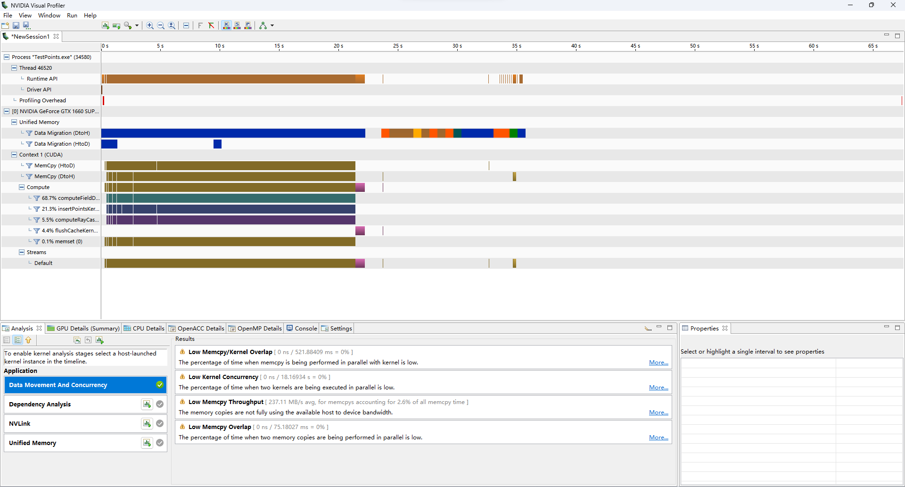

    - 主窗口中显示函数调用在时间线上的分布情况，横轴为程序运行时间，左侧列举出了CUDA相关的函数调用
    - 下方窗口是针对本次运行的统计信息（GPU Details）及优化建议（Analysis）

- 放大时间线

    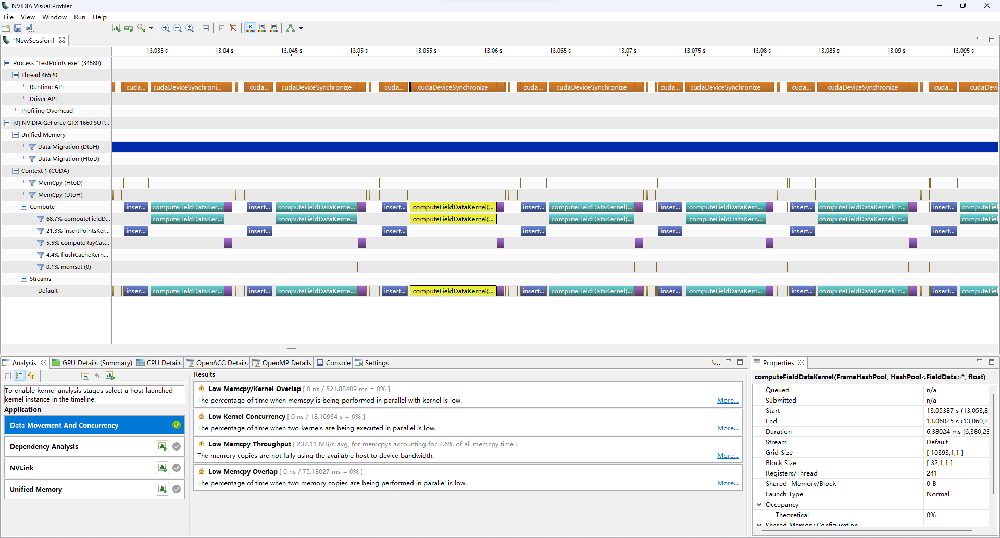

    - 鼠标悬浮即可在右下角查看当前函数调用的详细信息

### 性能调优建议

​	profile结束后通常可以在时间线上明显观察到耗时长的Kernel和API，针对Kernel的调优在下一节中介绍，针对CUDA API可能出现的性能瓶颈介绍如下：

- CudaMemcpy

​		左侧列表中有显示，如果对应行出现长耗时调用说明程序频繁地在host侧和device侧交换数据，这通常会导致性能瓶颈，因为主机内存与显存使用PCIE接口连接，其带宽远低于两侧核心到处理器的直接连线，而且在读写粒度小的数据时还会进一步降低。

​		建议：尽量减少host和device侧数据拷贝，如果必须拷贝尽量将小的数据块合并成一大块传输。

- CudaMemset

     同memset， 一般是由频繁清空一大块内存区域引起的。

     建议：这个API效率很高，一般不会成为瓶颈，如果真的瓶颈了就少用（

- CudaMalloc、CudaMallocManaged、CudaHostAlloc、......

​		内存分配类API，显示在第一行Runtime API中。注意这一行会有大量的Synchronize调用，而且都是一个色。。。

​		小寄巧：默认的内存分配API都是同步的，即调用前会等待GPU上的操作执行完成，并且在分配过程中GPU上不会有别的操作，所以在时间线上会形成一段空白，可以根据这个特征找。

​		建议：少用（

​		能提前分配完就提前分配完，运行过程中调用内存分配绝对是通常情况下能见到的最大开销，一定要运行时按需分配的建议配合异步流使用上述API的Async版本。

- Unified Memory Data Migration

​		统一内存数据拷贝，Unifield Memory中的数据会根据访问情况自动将数据搬运到Host侧或Device侧，这行数据是按照时间片分析的，颜色变红说明这段时间的拷贝强度较大，右下角Properties有详细解释。

​		建议：首先UM在Windows下的支持不如Linux完善，缺少很多高级功能（e.g. 显存超售）而且有时候行为和预期不一致（低情商：bug多），原则上不推荐使用，除非必须要在两侧维护同一套指针。拷贝压力大的优化方法和memcpy相同，减少Host - Device数据传输。

### 杂项

- 使用异步流的时候可以在时间线上观察不同流操作重叠情况（手头没有现成样例不放图了）
- 如果程序运行时间特别长，记录的数据太大会让NVVP变卡，受不了的可以换用Nsight Systems，功能类似

## 2. 使用Nsight Compute对单个Kernel进行优化

通常结合时间线图和具体业务逻辑能够直接发现不合理的代码段，修改后的性能可以满足需要。如果性能瓶颈位于Kernel内部，且肉眼观察无法直接发现简单优化点，此时需要对Kernel执行的具体情况进行分析。Nsight Compute是一个基于tracing的Kernel分析器，可以提供Kernel运行时的硬件统计信息和逐行的代码运行情况分析。

该方案的profile开销较大，分析器本身会占用大概2GB显存，一个Kernel需要处理5-10s，不建议一次profile很多个Kernel Launch（

Nsight Compute也包含在CUDA套件中，无需单独安装。

> Kernel优化中出现不可解释的性能提升或下降是正常的，相信玄学（

### 使用方式

- 推荐开启Generate Line Number Information编译选项（就在Generate GPU Debug Information下面）来获得汇编到源码的映射关系，其余编译选项__和Release版本相同，不要开GPU Debug Information__。

- 使用前需要保证调试程序可以访问到GPU性能计数器，一个简单的方式是以管理员身份运行Nsight Compute。

- 打开Nsight Compute，随意新建一个Project或者Quick Launch（Project是用于管理获得的分析数据的，不用也行）

- 左上角点击`Connect`，新建会话 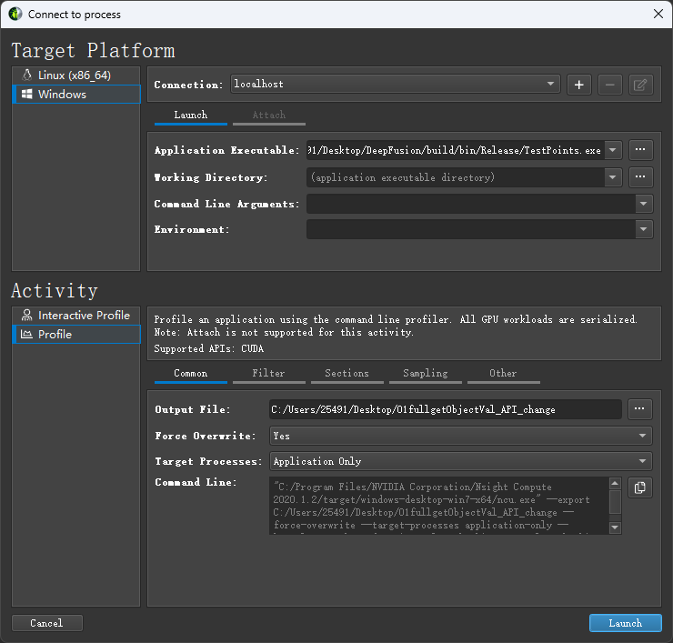

    - 填写需要调试的可执行程序，下方菜单必须要指定的参数是输出文件的路径
    - 鼠标悬浮在条目名称上会有详细解释 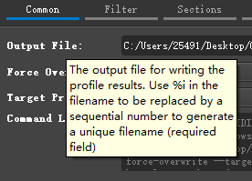，分析报告的大部分条目也有这种解释。

    - 几个常用可选参数：
        - Filter - Kernel Regex，根据正则表达式过滤需要profile的Kernel，仅分析匹配的Kernel。
        - Filter - Launch Skip Count，跳过开头的给定次数Kernel Launch。
        - Filter - Launch Capture Count，只分析给定次数个Kernel。
        - Sections，按需勾选需要的部分（懒得看就全勾就行）。
        - Other - Cache Control，默认分析开始前会把各级缓存清空，不需要这个功能的可以设为`Flush None`。
    - __不要什么参数都不改直接跑__，一个耗时几ms的Kernel分析一遍大概5-10s，一次执行可能有1000+的Kernel Launch，耗时。。。，一般应确保一次分析的Kernel Launch数不超过50。

- 全部设置完成后Launch，耐心等待profile完成，结束后不会自动打开分析数据，可以从左上角File - Open File打开。

### 查看统计信息

打开分析数据后会出现如下界面，左上Page页面可以切换，Launch下拉框切换不同的Kernel。

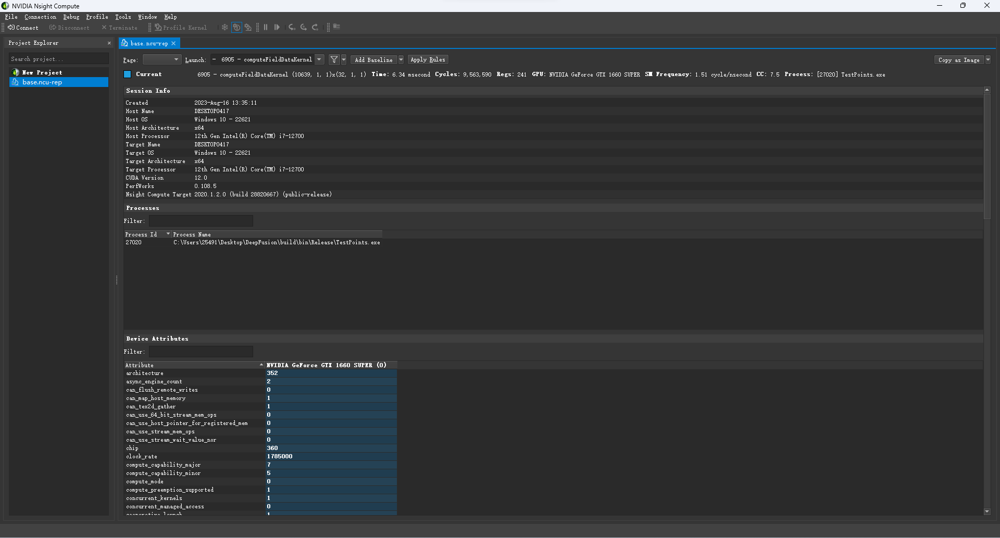

切换到Details页面，鼠标悬浮到条目名称上会有解释这条意思。

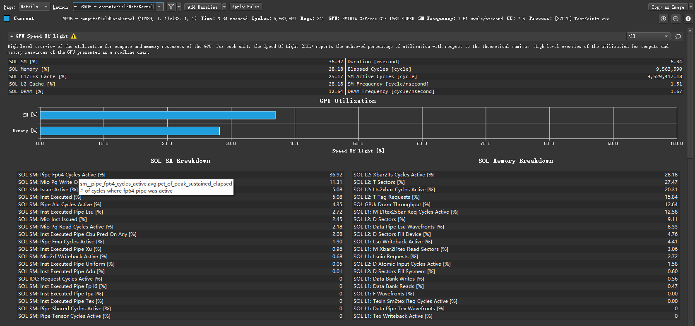

统计报告中部分条目带有黄色或蓝色感叹号，如下图，是官方的性能优化建议。

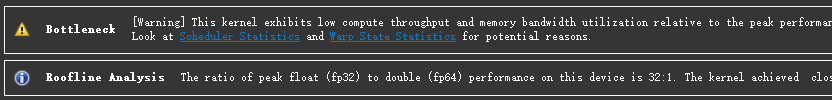

### 结合统计信息分析

> 统计信息中的很多指标都是互相耦合的，性能衡量首先还是看执行时间，在执行指令数相同的时候可以看IPC，单纯某个指标提高但是运行时间反而变长的情况是很常见的。

> 很多时候统计信息只能解释已有的优化是怎么生效的，而不是给出一个肯定可行的优化方向。对着一个指标狠狠地优化然后总体性能下降反而得不偿失（

Kernel运行常见瓶颈：

- 访存效率低下

    数据表现：SOL Memory低，各级Cache命中率低，各级Cache和Global Memory交换数据量大，Warp Stall主要原因为Stall Long Scoreboard。

    常见原因：访问地址不连续，间隔、随机访问；数据结构不对齐（GPU上推荐8字节对齐）；寄存器溢出导致的Local Memory压力大

    此处的地址连续是针对一个Warp内的32个线程而言。

    解决方案：数据结构强制对齐`alignas`，优化访存顺序，减少访问次数或减小结构大小，尝试使用Shared Memory。

GPU的缓存和CPU差不多，但是GPU核心比较多，而且微架构不太一样，所以内存、缓存压力比CPU大很多。

Memory Workload Analysis项显示了GPU上的内存架构模型，延迟从低到高分别是L1 Cache，L2 Cache，Device Memory(Global Memory)，System Memory(Zero-copy Memory)，Shared Memory独立于这个层次结构外，由程序员直接控制，其延迟与L1 Cache相当。

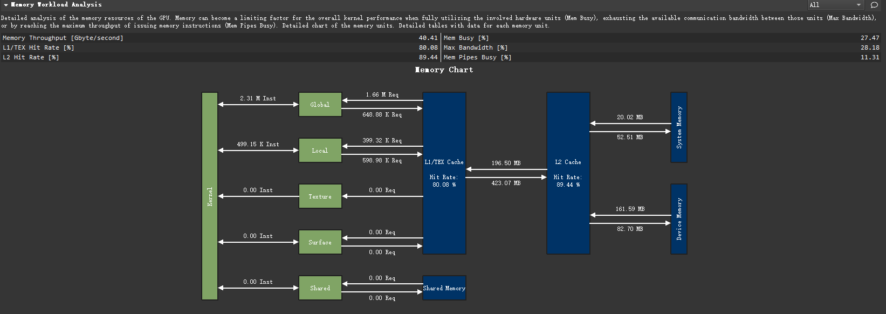

具体优化方式和CPU侧基本相同，如果业务逻辑上已知一些数据会被频繁访问可以放入Shared Memory中，往往效果显著。

> 关于Shared Memory：Shared Memory容量大约在几十KB/Block，由Block中的Threads共享，不同Threads间读写Shared Memory没有一致性保证，需要手动`__syncthreads();`或`__memoryfence();`，可以用于存放频繁访问数据或者线程间通信，Kernel中由`__shared__`限定的变量存放在该内存区域。
>
> Shared Memory Bank Conflict：一个Warp拥有的Shared Memory分32Bank，每个bank每个周期可以传输4bytes数据，当Shared Memory使用超过128bytes时可能出现同一周期两个请求落在同一个bank中，无法在一个Cycle中取出，影响访问效率。

- Occupacy低

    数据表现：Occupacy低

    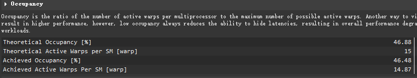

    常见原因：寄存器使用过多，Shared Memory使用过多，Block Size给太小了

    解决方案：逐项排查对应指标。

    局部变量使用过多还可能导致寄存器溢出到Local Memory，增加访存压力。

- IPC低

    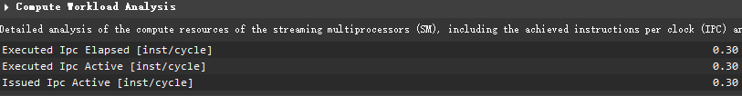

    数据表现：Issued Warp Per Scheduler低，Warp Cycle Per Instruction高

    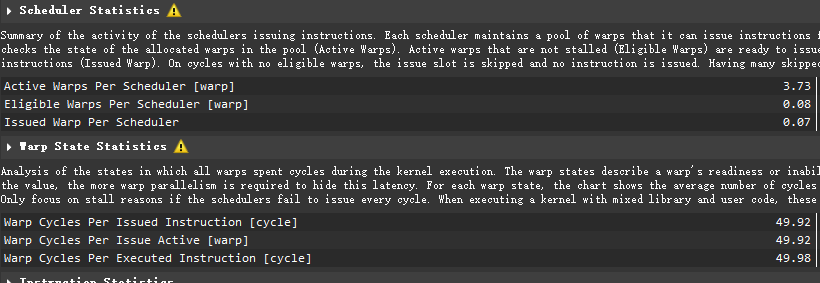

    常见原因：各种原因的流水线停顿，并且没有足够的任务可以切换来掩盖延迟

    解决方案：两个优化方向，减少指令停顿（通常为优化访存）来降低Warp Cycle Per Instruction或者减少每线程资源占用来同时往一个SM里塞进更多的Warp，提高Active Warp Per Scheduler。注意这两个方向可能互相冲突，降低延迟通常需要更多的寄存器、Shared Memory资源，很多Active Warp导致访存冲突也会增大Warp Cycle Per Instruction，具体方案需要尝试后决定。

### 结合逐行统计信息分析

如果经过以上所有步骤仍无法确定性能瓶颈，可以在Source页面直接确认每行代码的执行情况。

需要开启Generate Line Number Information编译选项才能看到源代码，不然只能看到汇编。

> NVCC在编译过程中会大量重排指令，生成的汇编和源代码顺序基本是完全不同，逐行分析仅供参考（

可以看到每行代码停顿原因，内存访问情况，活跃寄存器数量等信息。

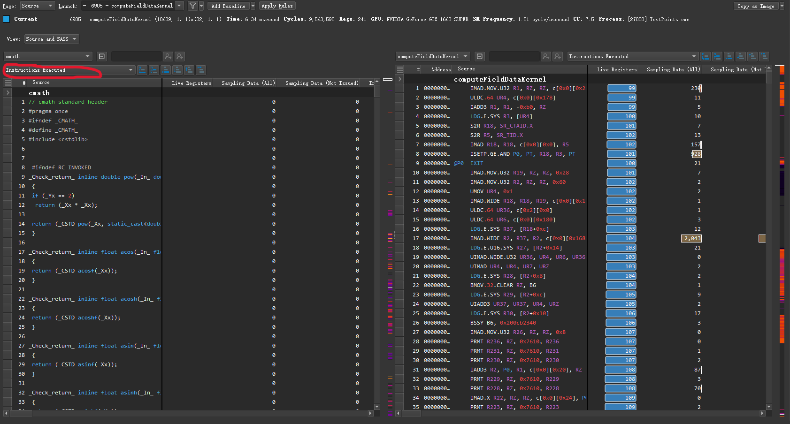

在红圈所示列表中可以选择对应列，然后跳转到数值最大的行。e.g.

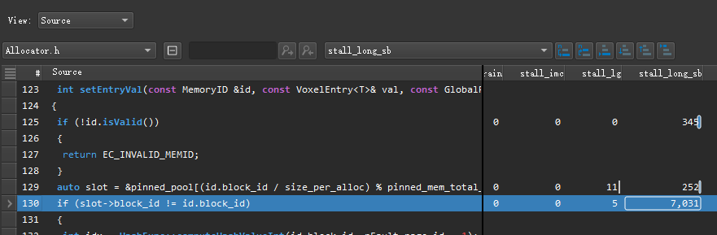

## 3、延伸阅读

[CUDA Optimization Tips from NVIDIA](https://on-demand.gputechconf.com/gtc/2017/presentation/s7122-stephen-jones-cuda-optimization-tips-tricks-and-techniques.pdf)官方的一篇General Purpose的CUDA优化指南

可以关注[NVIDIA Blog](https://blogs.nvidia.com)，有一些新功能的介绍和优化建议等（虽然大部分都是AI）
