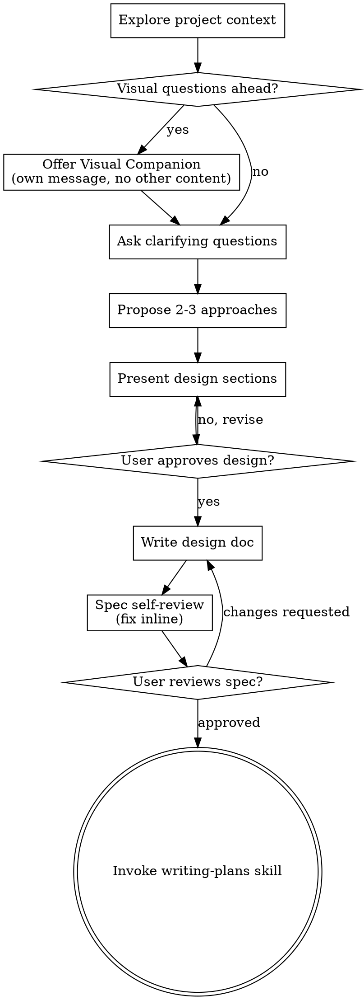

# Replay conversation

## User

讨论一下我理想中的编程语言。虽然古法编程已经快成为历史了，但是这次还是讨论的手写场景。你结合我的数据分析我的偏好来设计看看？

## Assistant

我来结合你的个人数据来分析你的编程偏好。先加载你的 profile 和相关上下文。

## User

Base directory for this skill: C:\Users\Yufeng Ying\.claude\skills\personal-context

---
name: personal-context
description: Use when answering questions about the user (Yufeng Ying / 应宇峰) — personal background, career history, tech skills, investment strategy, FIRE goals, or cross-project development context. Also use when user says "about me", references their profile, or asks anything requiring personal context about who they are.
---

# Personal Context Lookup

The user maintains a structured context repository. Read it to answer personal questions accurately.

## Repository Location

```
F:\Code\Context
```

If this path doesn't exist, check the `PERSONAL_CONTEXT_REPO` environment variable.

## Lookup Procedure

1. **Always start**: Read `profile.md` — covers 80%+ of questions (background, career, tech stack, investments, personality)
2. **GPU/CUDA details**: Read `VDB/VDB.md` and files under `VDB/交接文档/`
3. **Investment/FIRE planning**: Read Python scripts under `financial/` for methodology and parameters
4. **Cross-project history**: Browse `memory/<project-name>/MEMORY.md` indices

## Source Index

| Source | Content |
|--------|---------|
| `profile.md` | Full profile: 硕士毕业、思看科技GPU实习、FIRE规划、永久投资组合、技术栈、性格特征 |
| `VDB/` | GPU VDB sparse volume, TSDF fusion system (DeepFusionPoints), CUDA optimization |
| `financial/` | 哈利·布朗永久投资组合回测、FIRE退休模拟、支付宝基金筛选 |
| `memory/` | Synced memory snapshots from all Claude Code projects |

## Common Mistakes

- Guessing personal details instead of reading `profile.md` — always read first
- Answering financial questions without checking the actual backtest parameters in `financial/`
- Assuming VDB project details from general knowledge — the implementation has specific constraints (laptop GPU, Windows-only, IO-bound at 10^10 voxels)

## Profile Update Protocol

When a conversation reveals **significant** changes to the user's personal information, propose writing an update to the profile inbox.

### What counts as significant

Typical categories:
- 换工作、收入变化
- 搬家、城市变更
- 投资策略调整
- 新增或放弃技术栈
- 生活规划变更（FIRE 目标、婚育态度等）
- 学历、教育变化

Fallback rule: any information that would make an existing entry in `profile.md` inaccurate.

### What does NOT count

- Temporary states ("今天在调一个 bug")
- Information already in `profile.md` being mentioned again
- Speculative or uncertain information ("可能会换工作")

### How to write an update

1. Confirm with the user before writing
2. Append one entry to `F:\Code\Context/profile-inbox.md` in this format:

```markdown
---
date: YYYY-MM-DD
source: <current project directory name>
---
<what changed, in natural language>
```

3. Do NOT read or modify `profile.md` directly — the Context repo agent handles merging


ARGUMENTS: 分析用户的编程语言偏好，设计理想的手写编程语言

## Assistant

数据收集完成，现在进入创意设计阶段。

## User

Base directory for this skill: C:\Users\Yufeng Ying\.claude\plugins\cache\claude-plugins-official\superpowers\5.1.0\skills\brainstorming

# Brainstorming Ideas Into Designs

Help turn ideas into fully formed designs and specs through natural collaborative dialogue.

Start by understanding the current project context, then ask questions one at a time to refine the idea. Once you understand what you're building, present the design and get user approval.

<HARD-GATE>
Do NOT invoke any implementation skill, write any code, scaffold any project, or take any implementation action until you have presented a design and the user has approved it. This applies to EVERY project regardless of perceived simplicity.
</HARD-GATE>

## Anti-Pattern: "This Is Too Simple To Need A Design"

Every project goes through this process. A todo list, a single-function utility, a config change — all of them. "Simple" projects are where unexamined assumptions cause the most wasted work. The design can be short (a few sentences for truly simple projects), but you MUST present it and get approval.

## Checklist

You MUST create a task for each of these items and complete them in order:

1. **Explore project context** — check files, docs, recent commits
2. **Offer visual companion** (if topic will involve visual questions) — this is its own message, not combined with a clarifying question. See the Visual Companion section below.
3. **Ask clarifying questions** — one at a time, understand purpose/constraints/success criteria
4. **Propose 2-3 approaches** — with trade-offs and your recommendation
5. **Present design** — in sections scaled to their complexity, get user approval after each section
6. **Write design doc** — save to `docs/superpowers/specs/YYYY-MM-DD-<topic>-design.md` and commit
7. **Spec self-review** — quick inline check for placeholders, contradictions, ambiguity, scope (see below)
8. **User reviews written spec** — ask user to review the spec file before proceeding
9. **Transition to implementation** — invoke writing-plans skill to create implementation plan

## Process Flow



**The terminal state is invoking writing-plans.** Do NOT invoke frontend-design, mcp-builder, or any other implementation skill. The ONLY skill you invoke after brainstorming is writing-plans.

## The Process

**Understanding the idea:**

- Check out the current project state first (files, docs, recent commits)
- Before asking detailed questions, assess scope: if the request describes multiple independent subsystems (e.g., "build a platform with chat, file storage, billing, and analytics"), flag this immediately. Don't spend questions refining details of a project that needs to be decomposed first.
- If the project is too large for a single spec, help the user decompose into sub-projects: what are the independent pieces, how do they relate, what order should they be built? Then brainstorm the first sub-project through the normal design flow. Each sub-project gets its own spec → plan → implementation cycle.
- For appropriately-scoped projects, ask questions one at a time to refine the idea
- Prefer multiple choice questions when possible, but open-ended is fine too
- Only one question per message - if a topic needs more exploration, break it into multiple questions
- Focus on understanding: purpose, constraints, success criteria

**Exploring approaches:**

- Propose 2-3 different approaches with trade-offs
- Present options conversationally with your recommendation and reasoning
- Lead with your recommended option and explain why

**Presenting the design:**

- Once you believe you understand what you're building, present the design
- Scale each section to its complexity: a few sentences if straightforward, up to 200-300 words if nuanced
- Ask after each section whether it looks right so far
- Cover: architecture, components, data flow, error handling, testing
- Be ready to go back and clarify if something doesn't make sense

**Design for isolation and clarity:**

- Break the system into smaller units that each have one clear purpose, communicate through well-defined interfaces, and can be understood and tested independently
- For each unit, you should be able to answer: what does it do, how do you use it, and what does it depend on?
- Can someone understand what a unit does without reading its internals? Can you change the internals without breaking consumers? If not, the boundaries need work.
- Smaller, well-bounded units are also easier for you to work with - you reason better about code you can hold in context at once, and your edits are more reliable when files are focused. When a file grows large, that's often a signal that it's doing too much.

**Working in existing codebases:**

- Explore the current structure before proposing changes. Follow existing patterns.
- Where existing code has problems that affect the work (e.g., a file that's grown too large, unclear boundaries, tangled responsibilities), include targeted improvements as part of the design - the way a good developer improves code they're working in.
- Don't propose unrelated refactoring. Stay focused on what serves the current goal.

## After the Design

**Documentation:**

- Write the validated design (spec) to `docs/superpowers/specs/YYYY-MM-DD-<topic>-design.md`
  - (User preferences for spec location override this default)
- Use elements-of-style:writing-clearly-and-concisely skill if available
- Commit the design document to git

**Spec Self-Review:**
After writing the spec document, look at it with fresh eyes:

1. **Placeholder scan:** Any "TBD", "TODO", incomplete sections, or vague requirements? Fix them.
2. **Internal consistency:** Do any sections contradict each other? Does the architecture match the feature descriptions?
3. **Scope check:** Is this focused enough for a single implementation plan, or does it need decomposition?
4. **Ambiguity check:** Could any requirement be interpreted two different ways? If so, pick one and make it explicit.

Fix any issues inline. No need to re-review — just fix and move on.

**User Review Gate:**
After the spec review loop passes, ask the user to review the written spec before proceeding:

> "Spec written and committed to `<path>`. Please review it and let me know if you want to make any changes before we start writing out the implementation plan."

Wait for the user's response. If they request changes, make them and re-run the spec review loop. Only proceed once the user approves.

**Implementation:**

- Invoke the writing-plans skill to create a detailed implementation plan
- Do NOT invoke any other skill. writing-plans is the next step.

## Key Principles

- **One question at a time** - Don't overwhelm with multiple questions
- **Multiple choice preferred** - Easier to answer than open-ended when possible
- **YAGNI ruthlessly** - Remove unnecessary features from all designs
- **Explore alternatives** - Always propose 2-3 approaches before settling
- **Incremental validation** - Present design, get approval before moving on
- **Be flexible** - Go back and clarify when something doesn't make sense

## Visual Companion

A browser-based companion for showing mockups, diagrams, and visual options during brainstorming. Available as a tool — not a mode. Accepting the companion means it's available for questions that benefit from visual treatment; it does NOT mean every question goes through the browser.

**Offering the companion:** When you anticipate that upcoming questions will involve visual content (mockups, layouts, diagrams), offer it once for consent:
> "Some of what we're working on might be easier to explain if I can show it to you in a web browser. I can put together mockups, diagrams, comparisons, and other visuals as we go. This feature is still new and can be token-intensive. Want to try it? (Requires opening a local URL)"

**This offer MUST be its own message.** Do not combine it with clarifying questions, context summaries, or any other content. The message should contain ONLY the offer above and nothing else. Wait for the user's response before continuing. If they decline, proceed with text-only brainstorming.

**Per-question decision:** Even after the user accepts, decide FOR EACH QUESTION whether to use the browser or the terminal. The test: **would the user understand this better by seeing it than reading it?**

- **Use the browser** for content that IS visual — mockups, wireframes, layout comparisons, architecture diagrams, side-by-side visual designs
- **Use the terminal** for content that is text — requirements questions, conceptual choices, tradeoff lists, A/B/C/D text options, scope decisions

A question about a UI topic is not automatically a visual question. "What does personality mean in this context?" is a conceptual question — use the terminal. "Which wizard layout works better?" is a visual question — use the browser.

If they agree to the companion, read the detailed guide before proceeding:
`skills/brainstorming/visual-companion.md`


ARGUMENTS: 根据用户的编程习惯和偏好数据，设计一门理想的手写编程语言

## Assistant

好的，我已经从你的 profile、代码风格和项目历史中提取了大量信号。让我先把分析到的偏好摆出来，确认方向对不对，再往下深入。

## 你的编码 DNA 分析

从你的实际代码和 profile 中提炼出的关键偏好：

| 维度 | 观察到的倾向 | 数据来源 |
|------|-------------|----------|
| **类型** | 脚本场景不写 type hint，但系统场景用 Rust（强类型） | financial/ 全无注解；技术栈含 Rust |
| **范式** | 过程式为主，函数式为辅，**零 OOP** | 无自定义 class，全是裸函数+dict+array |
| **命名** | snake_case，ALL_CAPS 常量 | 全部 Python 脚本一致 |
| **错误处理** | 只在系统边界 try/except，内部不设防 | API 调用处才有 try，函数间零校验 |
| **抽象偏好** | 扁平 > 嵌套，中间变量 > 链式调用 | 显式命名中间步骤而非 one-liner |
| **GPU** | 第一性需求，关注 Triton/TileLang 等高层抽象 | CUDA 实习 + profile 明确提及 |
| **数据结构** | dict + numpy array + DataFrame，不造领域对象 | 所有金融脚本 |
| **迭代容忍度** | 手动迭代 ≤3 轮 | profile 明确写 |

一句话总结：**你想要 Python 的低摩擦 + Rust 的系统能力 + GPU 是一等公民，同时砍掉 OOP 和不必要的仪式。**

在进一步设计之前，我想确认一个最影响语言走向的问题：

## Assistant

有意思！你的回答出乎我预期——不是 GPU 或数据分析的细分场景，而是**大型工程的全局最优**。这其实对语言设计提出了更高的要求。

结合你的 profile 来理解这个回答：你在 CUDA 项目中体验过"从零搭大系统"的痛，你的 vibe coding 风格说明你在乎**给 agent 方向让它生成**的效率，而手写场景意味着你关注的是**架构层面的表达力**——模块怎么切、接口怎么定、错误怎么传播、类型怎么约束。

继续挖一个关键维度：

## Assistant

好，**错误即类型 + 不可变优先**——这两个选择很有性格。你既要 Rust 级别的安全承诺，又不要 Haskell 的纯函数教条。

下一个问题关于"多端"——这对语言的编译目标和运行时设计影响很大：

## Assistant

Web + 移动 + 桌面，明确了。编译目标是 native + WASM，运行时需要 GC 或引用计数的选择。

还有一个对"大型应用 scalability"至关重要的问题——类型系统的表达力：

## Assistant

非常好。现在画像很清晰了，让我综合所有数据提出方案。

---

## 你的语言偏好画像总结

| 需求 | 你的选择 |
|------|---------|
| 定位 | 大型多端应用，工程 scalability |
| 平台 | Web (WASM) + 移动 + 桌面 |
| 安全 | 错误即类型 + 不可变优先 |
| 类型系统 | 强力但务实——建模问题，不耍杂技 |
| 范式 | 过程式 + 函数式，**零 OOP** |
| 风格 | snake_case，扁平结构，显式中间变量 |
| 额外约束 | 手写体验低摩擦，手动迭代 ≤3 轮 |

## 三种设计方向

### 方向 A：Safe Imperative（推荐）
**"如果 Rust 去掉了 borrow checker，换成 ARC，保留其他一切"**

- 代数数据类型 + pattern matching + trait，无 class
- `let` 不可变，`var` 可变，编译器追踪可变范围
- Result\<T, E\> 错误处理，但用 `try` 块语法糖替代 Rust 的 `?` 链
- 自动引用计数（ARC）+ 弱引用 cycle break，无 GC 停顿
- 编译到 LLVM native + WASM
- trait 泛型约束，有关联类型但**无高阶类型**，天花板封死体操空间

**优势**：最接近你现有心智模型（Rust 经验 + Python 习惯），ARC 去掉了生命周期标注的最大摩擦源。
**风险**：ARC 在循环引用场景需要纪律（weak ref），性能比 Rust 略低。

### 方向 B：ML-Family Pragmatist
**"如果 OCaml 有一流工具链、跨平台编译、且不那么学院派"**

- Hindley-Milner 全局类型推断——几乎不写类型注解
- pattern matching 作为核心控制流
- 模块签名系统（OCaml 最强特性）天然强制接口边界
- GC 运行时（分代式）
- 编译到 native + WASM

**优势**：推断能力最强，手写最少字符量。模块签名是大型工程的杀手级特性。
**风险**：与你现有过程式心智模型差距较大，函数式思维切换成本高。你的代码风格（可变中间变量、命令式循环）在这里会别扭。

### 方向 C：Effect-Typed
**"如果错误、IO、可变性全部由 effect 系统在类型层面追踪，但用起来不痛苦"**

- 函数签名声明自己的 effect：`fn read_config() -> Config with {io, fail<ParseError>}`
- 默认纯函数，effect 必须显式声明
- 编译器自动推断 effect 传播，你只在边界处标注
- 比 Result 更统一——错误、IO、mutation 一套机制搞定

**优势**：对大型代码库 scalability 最好——看一眼签名就知道函数做了什么。完美匹配你"只在边界处理错误"的习惯。
**风险**：最激进的设计，学习曲线最陡。手写时 effect 标注可能反而增加摩擦。

---

**我的推荐是方向 A（Safe Imperative）**，理由：它和你的现有技能树（Rust + Python）摩擦最小，同时满足所有核心需求。但我会从方向 C 偷一个想法——在 A 的基础上加入轻量 effect 标注用于 IO 和错误可见性，不走完整 effect system。

你觉得哪个方向最对味？或者想从不同方向各取一些？

## User

这是一个理想实验，因此不妨激进点。这个设计并不追求落地。我认为可以有超强的类型系统（但是我不会去做类型体操）、最智能的推断、GC、先进的学术工程设计等

## Assistant

好，理想实验模式——不用管实现成本，把学术界这二十年最硬的货全塞进来，只按你的手感挑形状。

先摆这个设计的**公理**，每一条都能在你的数据里找到出处：

| 公理 | 数据出处 | 设计承诺 |
|------|---------|---------|
| 能推的绝不让人写 | financial/*.py 零类型标注 | 标注是文档，不是编译条件 |
| 错误只在边界处理 | 你的 try/except 只存在于 API 调用处 | 效应全推断，中间层零负担 |
| 零 OOP | 可查代码里一个 class 都不造 | ADT + 模块 + UFCS，没有继承 |
| 手写 ≤3 轮 | profile 原文 | 报错必须自带修复方案 |
| 要 GC 不要借用检查 | 本轮选择 | 唯一性推断接管内存优化 |
| 渐进披露 | "不预习，just-in-time" | 10 行能跑，深度按需展开 |
| 编译器要有判断力 | 你评价 agent 的标准 | 推不出时，带着方案来问，而不是甩错误 |

一句话身份：**「写起来像脚本，错不了像证明，跑起来哪里都能去——而且讨厌让你多说一个字。」**

代号先叫 **灵 (Ling)**——推断要灵，顺带谐音"零"：零标注、零仪式、零体操。（命名权在你，还有备选：序 / 悟）

---

## 一、类型系统：三层，各有一个动机

**L1 日常层（95% 的时间在这里）**
Hindley-Milner + 双向推断 + 行多态记录 + 结构化约束（不是继承）。你什么都不写。加上 MLsub/Simple-sub 的主类型子类型后有个质变：**永远不需要为了让类型通过而重构代码结构**——记录宽度、深度自动适配，不需要发明 adapter 类。你 Python 里那套 dict 裸奔的数据流，在这里天然是有类型的。

**L2 精化层（把业务常识写进类型，但不用写证明）**

不是依赖类型——那是体操的原产地。走 Liquid Types 的路线：精化 + SMT 求解。你写业务里的不等式，solver 干活：

```
type Weight    = Decimal where 0.0 <= it <= 1.0
type Portfolio = List<Asset> where it.map(.weight).sum ~= 1.0
type NonEmpty[T] = List[T] where it.len > 0
```

（`it` 指值自己；`~=` 是"约等"——数字类型的一等约束，做金融的人懂）

精化自动传播：字面量 refine、guard 检查 refine、签名 refine，一路推到调用点。便宜的自己证掉，证不掉的……不会让你去写证明项，见第五节。

**L3 专家层（库作者专用，日常界面里不存在）**
GADT、一阶模块、高阶类型。都在，文档明确写"你也许永远用不到"。这是"强但不鼓励体操"的工程答案：**不是阉割能力，而是调节默认值。**

**反体操的五个减压阀**
1. 精化 > 依赖类型（吃 90% 收益，0% 证明项）
2. 推断 > 标注（hover 看推断结果，写了是文档，不写不判错）
3. 诊断 > 报错（每个错误带可执行修复）
4. 默认值 > 抽象（不发明抽象也能安全，L2 兜底）
5. 风格守则进工具（实例化深度超阈值会问"你确定？"）

## 二、错误与效应：你最在意的部分

全职方案：行多态代数效应，全推断。错误只是其中一个效应族 `fail<E>`，和 `io`、`state`、`async` 平级。

Java 式 checked exception 为什么讨人厌？——要手写、污染签名、没有多态。这里三条全部解决：**推断**（一个字不写）、**行多态**（`map` 对任意错误族通用，不用为错误类型发明抽象）、**handler 是一等值**（错误处理逻辑可以像数据一样传递、组合、测试）。

于是你"只在边界 try/except"的习惯，从个人风格升格为类型系统的定理。panic 单独存在——专给真 bug，不进类型系统。async 也是效应，**没有函数染色**：谁调用谁自动带上，签名不用改。

```
# ── 错误的生命周期：中间层 = 0 个字 ──────────────────────

fn fetch_quotes(symbols: List<String>) -> List<Quote>
    # 编译器推断出: with { async, net, fail<NetError> }
    symbols |> par_map(fn s => http.get_json(qurl(s)))

fn daily_decision(held: Portfolio) -> Rebalance
    quotes = fetch_quotes(held.symbols)     # fail 自动上行:没有 ?,没有 try
    diff(held, compute_target(quotes))      # 纯函数,编译器知道它失败不了

fn run() -> Report                           # 边界:错误在这里才被决定
    attempt
        daily_decision(PORTFOLIO) |> execute
    on fail<NetError>(e) -> Report.hold(reason: e)    # 网络问题 → 降级持仓
    on fail<LedgerError>(e) -> panic(e)               # 记账不一致 = bug → 炸
```

**模块能力声明**——架构规矩直接变成编译检查：

```
module domain.pricing
    may only { pure, fail<PricingError> }    # 领域层禁止 io,违规 = 编译不过
```

分层架构、依赖方向、副作用预算——平时靠人肉 review 守着的东西，现在编译器直接拒。这可能是对"大型工程 scalability"最狠的一条。

## 三、不可变与值语义：写不可变，跑得像可变

`let` 默认不可变，`var` 是局部事务（出不了函数），持久化集合（结构共享 vector/hashmap）进标准库。

**唯一性推断（FBIP / Perceus 血统）**：编译器发现某值独享且马上失效，就原地改写它。`list |> map(f)` 独享时是原地循环，共享时是复制。同一份源码两种性能——**你不用做任何事**。共享可变状态在类型层面不存在（要 `atomic` 细胞显式声明），数据竞争直接不可能发生。

结构化并发是语法的一部分：`scope { a = spawn f(); b = spawn g(); a + b }`——子任务错误自动并入当前 fail 集，取消沿作用域传播，没有"野线程"概念。

## 四、手感（直接抄你的手）

- 缩进风格、表达式导向、`case` 匹配、`|>` 管道、UFCS（`x.f(y)` ≡ `f(x,y)`——有方法手感，无 OOP）
- 标识符允许 Unicode；formatter 唯一风格，且**认识横幅注释**——你做 `=====` 分隔线、小节标题那套习惯，formatter 替你维护对齐；常量保持你 ALL_CAPS 的写法
- 编译器消息中文一等公民（不是机翻）；英文标识符 + 中文注释是默认最佳实践——就是你写 financial/ 的样子

## 五、编译器有判断力（你的 agent 标准，用到工具链上）

这是我最想推销的一节。你的原话：判断力 = 在合适的时机提出合适的问题。工具链照此设计：

```
✗ portfolio.ling:52  类型不匹配

  Portfolio 要求:  sum(weight) ≈ 1.0 ± 1e-6
  你给的是:        sum(weight) = 0.9721

  三个方案(这更像建模线索,不是错误):
  [1] normalize(target)          —— 归一化,一行                    ← 推荐
  [2] 放宽 Portfolio 精化到 ±3%  —— 如果你真接受漂移
  [3] 查为什么少了 QDII         —— 我比对了 symbols 列表,差异在这 →

  回车采用推荐项;agent 走 JSON-RPC 拿同一份结构,不需要解析文本。
```

- 每条诊断 = **最小反例 + 至少一个可执行修复 + 真正含糊时才提问**。设计 KPI：常用错误首轮修复率 ≥ 90%，读错误永远不超过 5 行，手写 ≤3 轮是设计合同。解释不出修复的错误算编译器 bug。
- 结构化 API 是原生的：洞、效应查询、修复应用、批量迁移（签名 diff → semver 判定 → 自动 codemod）。你的 vibe coding 在这门语言里是**协议级支持**，不是让 agent 对着报错文本猜。
- 类型即方向：agent 的工作从"猜你要什么"变成"填一个带类型的洞"。
- 内建 profiling / roofline 钩子——CUDA 那套直觉，语言层面给你。

## 六、运行时与多端：一个语义，多个后端

- 语义核心只有一个：值语义 + 不可变默认 + 效应。后端三个：native（LLVM）、WASM（wasm-gc + stack-switching）、移动（同 native + 平台 interop）。
- GC：并发分代 mark-region（Immix / LXR 血统），停顿亚毫秒、无感；WASM 侧直接用 wasm-gc 提案。值/引用/装箱全部隐式。
- 效应编译：native 用一次性定界续体，WASM 用栈切换——handler 在两端都接近零成本抽象。
- 跨端检查在模块级：声明 native-only 的模块出现在 web 构建图里 = 编译错误。一套源码，构建系统出三端产物。
- 编译器本身走查询式架构（Salsa 血统），增量到函数级，跨模块用签名密封。
- 标准库里有一等公民的表格类型 + 类型安全查询——你 pandas 那部分，在这门语言里是语法级的。

## 七、刻意不做（和做一样重要）

❌ 依赖类型 / 证明项（精化已覆盖收益） ❌ 借用检查器 / 生命周期标注（唯一性推断 + GC 拿走了它的全部理由） ❌ class / 继承 ❌ 函数染色 ❌ 手工内存管理 ❌ 头文件 / 前向声明 / 编译顺序依赖 ❌ 文本宏 ❌ "多范式"杂烩（每个需求只给一个官方答案，减少范式选择税）

## 学术血统

| 部件 | 血统 |
|------|------|
| 推断 | HM → MLsub / Simple-sub（主子类型）、双向推断 |
| 精化 | Liquid Types / F*（SMT 路线） |
| 效应 | Koka / Effekt / OCaml 5 effect handlers |
| 复用 | Perceus / FBIP |
| GC | Immix / LXR（mark-region） |
| 模块 | OCaml modules / Backpack |
| 并发 | Trio 式结构化并发 |
| 洞与修复 | Hazel typed holes / MYTH 错误切片 / Idris auto |
| WASM | wasm-gc、stack-switching 提案 |

---

这里几乎没有一个是全新发明——价值在于这个组合是按你的数据选的，而且部件之间不打架（这反而最难：效应推断喂给唯一性推断，精化喂给诊断，判断力原则统摄整个工具链）。语法样例只是示意，细节随便拧——神在这些机制里。

哪里不对味直接说，理想实验里没有"实现不了"的挡箭牌，只有"这个形状对不对"。几个我已经感觉有张力的点：GC 与 FBIP 的边界、"精化自动传播"激进到什么程度才不像体操、中文诊断一等公民会不会太私人。

